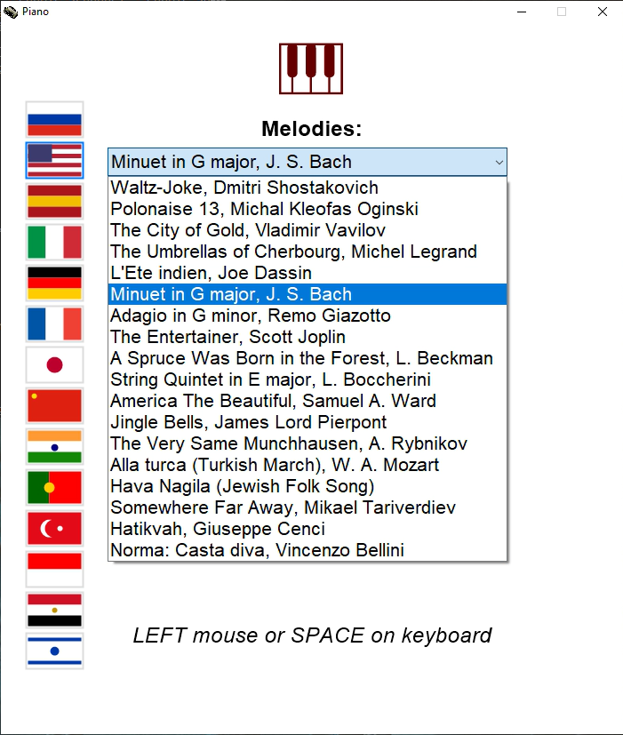

# 🎹 Piano MIDI Synthesizer & Player
Welcome to the official repository of **Piano** — a lightweight, high-performance, standalone virtual piano player and polyphonic audio synthesizer developed natively for Windows using Win32 API and GDI+.

## 🎮 How to control:
* Use the **LEFT mouse button** to switch vector flags and browse melodies.
* The big PLAY NOTE button can be triggered by either clicking your LEFT mouse button or pressing the SPACE bar.

### 🎹 The Core Philosophy: "Zero-Mistake Rhythm Conducting"
The main innovation of this Piano is that the user **never has to worry about playing the wrong notes**. 
* **Perfect Pitch (Hz):** Every single frequency and musical pitch is precisely pre-programmed into dense note vectors. It is mathematically **impossible to hit a wrong note or make a mistake!**
* **Time is Yours:** The timing, spacing, and emotional tempo are completely unconstrained. By pressing the keyboard or mouse, **YOU create the rhythm and time layout** dynamically. 

You don't just hit keys — you **conduct** the masterpiece!

## 🚀 Key Technical Features:
* **Advanced 5-Voice Polyphony:** Built-in additive synthesizer generating standard frequency (`f1`), octaves (`f2`, `f3`), an organ-like fifth overtone (`f4 = f1 * 3`), and a thick sub-bass floor (`f_sub`).

## 🌍 Supported International Languages (14 Regions):
The application supports on-the-fly UI localization. Clicking any flag dynamically translates all prompts, control text, and song arrays:
1. **🇷🇺 Russian (RUS)** — Native localization for Cyrillic users.
2. **🇺🇸 English (ENG)** — The default international standard interface for global compatibility.
3. **🇪🇸 Spanish (ESP)** — Full translation for European and Latin American regions.
4. **🇮🇹 Italian (ITA)** — Native classical music terminology localization.
5. **🇩🇪 German (DEU)** — High-precision musical terminology alignment.
6. **🇫🇷 French (FRA)** — Traditional Western European cultural standard alignment.
7. **🇯🇵 Japanese (JPN)** — Full Kanji/Kana rendering with advanced font anti-aliasing.
8. **🇨🇳 Chinese (CHN)** — Native simplified characters format for East Asian users.
9. **🇮🇳 Hindi (IND)** — Complete Devanagari script layout rendering.
10. **🇵🇹 Portuguese (POR)** — Extended Western Iberian and Brazilian localization.
11. **🇹🇷 Turkish (TUR)** — Complete native translation for Near Eastern region.
12. **🇮🇩 Indonesian (IDN)** — Full standard Southeast Asian Austronesian localization.
13. **🇪🇬 Arabic (EGY)** — Full UTF-16 text localization support.
14. **🇮🇱 Hebrew (ISR)** — Extended native character translation support.

## 🎼 Built-in Compositions (18 Iconic Melodies):
The synthesizer includes a carefully selected list of international masterpieces, folk tracks, and cinematographic themes pre-computed into highly dense note vectors:
1. **Dmitri Shostakovich — Waltz-Joke** (A playful, rapid neoclassical Soviet masterpiece).
2. **Michał Kleofas Ogiński — Polonaise No. 13 "Farewell to the Homeland"** (A deeply emotional, melancholic Polish classical anthem).
3. **Vladimir Vavilov — The City of Gold** (A magnificent, ethereal Renaissance-style melody often credited to Francesco da Milano).
4. **Michel Legrand — The Umbrellas of Cherbourg** (The heartbreaking, legendary French cinematic romantic theme).
5. **Joe Dassin — L'Été indien (Indian Summer)** (A smooth, nostalgic French pop masterpiece filled with acoustic warmth).
6. **Johann Sebastian Bach — Minuet in G major** (The timeless, structured Baroque educational keyboard exercise from the Notebook for Anna Magdalena Bach).
7. **Remo Giazotto — Adagio in G minor** (A profound, dramatic neo-Baroque symphonic movement based on a fragment by Tomaso Albinoni).
8. **Scott Joplin — The Entertainer** (The world's most famous, upbeat American ragtime syncopated piano track).
9. **Leonid Beckman — A Spruce Was Born in the Forest** (The ultimate traditional Eastern European winter holiday folk song).
10. **Luigi Boccherini — String Quintet in E major (Minuet)** (A light, elegant, courtly Western European classical dance theme).
11. **Samuel A. Ward — America the Beautiful** (A patriotic, powerful American symphonic hymn celebrating natural landscapes).
12. **James Lord Pierpont — Jingle Bells** (The globally recognized, joyful winter holiday anthem).
13. **Alexei Rybnikov — The Very Same Munchhausen** (The whimsical, flying soaring theme from the famous philosophical Soviet film soundtrack).
14. **Wolfgang Amadeus Mozart — Alla Turca (Turkish March)** (The rapid, iconic third movement from Piano Sonata No. 11 simulating Janissary bands).
15. **Jewish Folk Song — Hava Nagila** (A celebratory, accelerating traditional Hebrew folk dance melody filled with energy).
16. **Mikael Tariverdiev — Somewhere Far Away** (The nostalgic, deeply dramatic spy-drama anthem from "Seventeen Moments of Spring").
17. **Giuseppe Cenci — Hatikvah** (A beautiful, historic lyric melody based on a 19th-century poem, sharing roots with European folk music).
18. **Vincenzo Bellini — Norma: Casta Diva** (The pinnacle of Italian Bel Canto opera art, an intense, fluid prayer aria).

